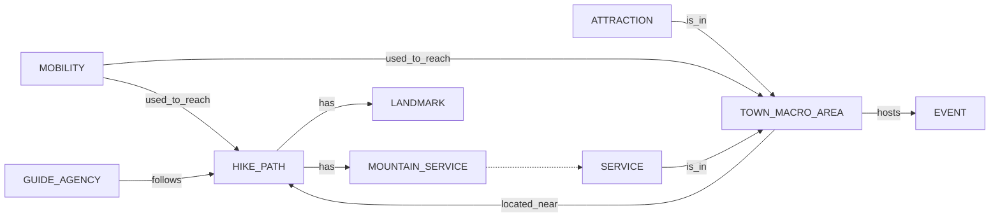

# Purpose Definition

### Informal Purpose

The goal of this project is to build a Knowledge Graph that handles and makes available data about hikes in the Trentino province, and supplements it with additional information about related entities. The KG will help connect tourists looking for a vacation, locals planning their weekend trips, local businesses trying to improve their reach and more.

### Domain of Interest (DoI)

The domain of interest is the Trentino province in the year 2025 (but with the possibility of expansion as futura data comes out), with a particular focus on hiking trails.

### Scenarios Definition

1. _made-up-name_ and her family, her husband and 2 children (8, 12) are planning a summer trip to Trentino. They are looking for a week long stay at a hotel next to simple and short hikes that they can go on together and hope to see some local landmarks. They would like to visit during some local event in order to enjoy the local culture more. They can reach the place with their car but would prefer having many services in walking distance from their accomodation place.
2. _made-up-name_ works at a travel agency. He has to set up four different vacation plans to offer in the Trentino area. Two of them have to be summer oriented, and the other two winter oriented. For each of those groups, one has to be nature oriented, one has to be more sport and other outdoor activities oriented. Both can of course contain minor activities that deviate from the main focus. As the travel agency is looking for specific deals with local services, accomodation and attractions, they are trying to keep both of the summer plans and both of the winter plans to the same general areas.
3. _made-up-name_ is looking for a hike he can go on a weekend to blow off steam from his studies. He lives in Trento and has access to local public transport, but not a car. He wants to start in the morning, reach a mountain refuge-restaurant for his lunch, then come back in the afternoon.
4. _made-up-name_ wants to go on a multiple day long hike with her friends this winter. They are expert excursionists and want to spend the night at a bivouac.
5. _made-up-name_ is a primary school teacher who is planning a trip for a class of hers. They want to go on a simple hike to see some of the local historical remains in the region (for example trenches or forts from the Great War) present on the territory. They need a local guide that can explain the significance of the remains they are going to find.
6. _made-up-name_ is volunteering at a local summer colony, and is looking for a simple trip they can bring the children on for one of the days. They are mainly looking for something simple that does not require additional guides and is reachable with public transport.

### Personas

1. _made-up-name_ is 38 years old. She likes a balance between outdoor activities, cultural experiences and downtime at comfortable accomodations.
2. _made-up-name_ is a 46 year old employee that works at a travel agency.
3. _made-up-name_ is a 22 year old student. He likes nature-oriented immersive adventures.
4. _made-up-name_ is 29 years old. Although not her job, she is an expert hiker and climber, and likes going on challenging trips in nature with her group of friends.
5. _made-up-name_ is a 52 year old primary school teacher.
6. _made-up-name_ is 30 years old and he is volunteering at a summer colony for kids.

### Competency questions
| Person | No. | Question |
|-|-|-|
|name|1.1| Which area offers that has hikes with landmarks to see also hosts events during summer? |
|name|1.2| Which hotels are in that area? |
|name|1.3| Are the events free or do we need to buy tickets? |
|name|1.4| Are there restaurants there? |
|name|1.5| Which hikes around that area are kid-friendly? |
|name|1.6| What can I see on those hikes? |
|name|2.1| Which area has both summer oriented outdoors attractions and is close to hikes that are open in summer? |
|name|2.2| Which area has both winter hikes and ski slopes nearby? |
|name|2.3| Which hotels are available in the area? |
|name|2.4| Which guides are available for the trails? |
|name|2.5| Are there buses or other mobility services that connect those places? |
|name|2.6| Which other services are available in that area? |
|name|3.1| What is a hike with a mountain lodge restaurant checkpoint roughly in the middle? |
|name|3.2| Which options are there to reach the start and end of that trail with public transport? |
|name|4.1| Which more challenging and long hikes are available in winter? |
|name|4.2| Are there bivouacs or other mountain huts on the path of the trail? |
|name|4.3| What equipment is needed for those trails? |
|name|5.1| Which simple hikes visit historical landmarks? |
|name|5.2| Which guides that can also tell us about the local history are available for those hikes? |
|name|6.1| Which areas have simple hikes with natural landmarks? |
|name|6.2| Which other attractions are in those areas? |
|name|6.3| Which public transport solutions are available to reach those places? |

### Concepts

| Scenario | Personas | Competency questions | Entities | Properties | Focus |
|----------|----------|----------------------|----------|------------|-------|
| 1, 2, 3, 4, 5, 6 | names | 1.1, 1.5, 1.6, 2.1, 2.2, 2.4, 3.1, 3.2, 4.1, 4.2, 4.3, 5.1, 5.2, 6.1, 6.3 |hike paths| name, months_open, difficulty, min_max_people, length, start_coords, end_coords| core |
| 1, 5, 6 | names | 1.1, 1.6, 5.1, 5.2, 6.1 |landmarks| name, type, coords| common |
| 3, 4 | names | 3.1, 4.2 |mountain service| name, type, price_range, coords| contextual |
| 1, 2 | names | 1.2, 1.4, 2.3, 2.6 |service| name, type, price_range, coords| common |
| 2, 3, 6 | names | 2.5, 3.2, 6.3 |mobility| name, price| common |
| 1, 2, 6 | names | 1.1, 1.2, 1.4, 1.5, 2.1, 2.2, 2.3, 2.5, 2.6, 6.1, 6.2, 6.3 |town macro area| name, coords| core |
| 2, 6 | names | 2.1, 2.2, 6.2 |attraction| naem, type, price, coords| common |
| 2, 5 | names | 2.4, 5.2 |guide_agency| name, price, offers| contextual |
| 1 | names | 1.1, 1.3 |events| name, date(s), coords| contextual |

### ER model

