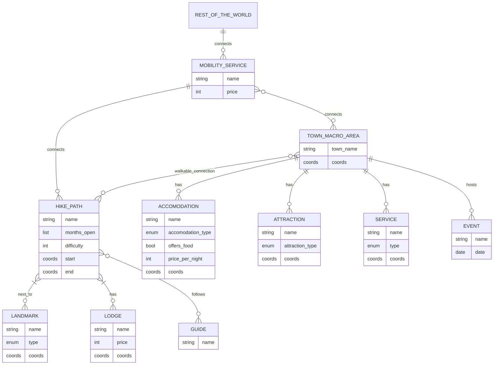

# Purpose Definition

### Informal Purpose

The goal of this project is to build a Knowledge Graph that handles and makes available data about hikes in the Trentino province, and supplements it with additional information about related entities. The KG will help connect tourists looking for a vacation, locals planning their weekend trips, local businesses trying to improve their reach and more.

### Domain of Interest (DoI)

The domain of interest is the Trentino province in the year 2025 (but with the possibility of expansion as futura data comes out), with a particular focus on hiking trails.

### Scenarios Definition

1. _made-up-name_ and her family, her husband and 2 children (8, 12) are planning a summer trip to Trentino. They are looking for a week long stay at a hotel next to simple and short hikes that they can go on together and hope to see both natural and historical local landmarks. They can reach the place with their car but would prefer having many services in walking distance from their accomodation place.
2. _made-up-name_
3. _made-up-name_
4. _made-up-name_
5. _made-up-name_
6. _made-up-name_

### Personas

1. _made-up-name_ is a 38 year old marketing manager who lives in Torino. She likes a balance between outdoor activities, cultural experiences and downtime at comfortable accomodations.
2. _made-up-name_
3. _made-up-name_
4. _made-up-name_
5. _made-up-name_
6. _made-up-name_

### Competency questions

### Concepts

### ER model

# NOTES
---------------------------------------------------------------------------------

### Scenarios

- someone who wants to plan a week long vacation with their family
- a travel agency employee preparing a vacation package for their clients
- a local looking for a hike to go on his own during the weekend
- an expert hiker who is looking for a more nature-immersive experience to go on with his group
- a primary school teacher planning for a school trip
- a summer colony organiser looking for activities to plan

### Personas
TODO

### Competency Questions

- What are simple hikes with great wintery natural views suitable for a family vacation?
    - "family vacation" -> can we assume long so requires accomodation?
    - no specification of vehicles means they have access to car?
- Give hikes next to places with ski slopes
- What hikes can I go to if I am spending a week in Folgaria?
- Where can I go on a hike in a summer break weekend with my college/work friends?
- Long hikes with overnight stay in refuge with running water
- ...
- TODO

### Concepts and Terms

- hike paths (difficulty, active_seasons, max-min group size)
- landmarks (type, active_season, bool_requires_detour_from_path) - how can we include things that are not really landmarks? e.g. I want to go on a hike to see deer / I want to go on a hike to get mushrooms
- lodges (_hiking services_) (*services_provided, stars_score, price)
- accomodation (type, stars_score, price)
- mobility services
- town macro area
- attraction
- services
- guides
- events

*have to do scenarios and personas first*
| Scenario | Personas | Competency questions | Entities | Properties | Focus |
|----------|----------|----------------------|----------|------------|-------|
| TODO     | TODO     | TODO                 |hike paths| see ER| core|
| TODO     | TODO     | TODO                 |landmarks| see ER| common|
| TODO     | TODO     | TODO                 |lodges| see ER| contextual|
| TODO     | TODO     | TODO                 |accomodation| see ER| common|
| TODO     | TODO     | TODO                 |mobility services| see ER| common|
| TODO     | TODO     | TODO                 |town macro area| see ER| core|
| TODO     | TODO     | TODO                 |attraction| see ER| common|
| TODO     | TODO     | TODO                 |services| see ER| common|
| TODO     | TODO     | TODO                 |guides| see ER| contextual|

### ER model *** (!!! Prof said it is not exactly an ER model even thought it's called that in the slides) -> cardinality of relationships should not matter

A service that allows people or vacation agencies to plan for their hikes in Trentino's territory, based on:
- their __expertise__ in hiking
    - are there children?
    - are there only able bodied but not expert adults?
    - are there only experts?
- how big of a group should consider this hike
- in which __period__ of the year is this accessible
- the kind of experience they want
    - looking for particular __landmarks__?
    - presence of "__hiking services__" (bivouacs/refuges/lodges/moutain huts)
- the __access__ to the route:
    - is a car required to get there?
- the __accomodation__ for the rest of the vacation:
    - are there nearby hotels/camping sites?
- other __attractions__ in the same area (related or not to the hike):
    - ski slopes
    - museums
- generic __services__ in the same area:
    - convenience store
    - hospital
    - post office
    - pharmacy
    - restaurant
- __hiking guides__ or agencies that offer guidance on specific hikes

