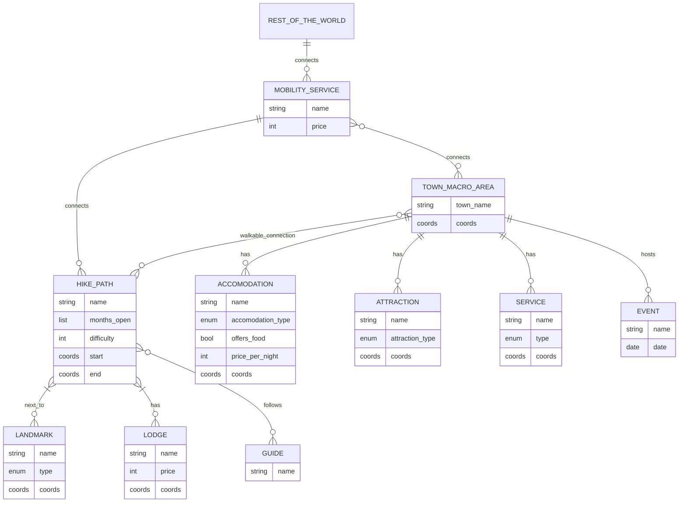

# Purpose Definition

### Informal Purpose

The goal of this project is to build a Knowledge Graph that handles and makes available data about hikes in the Trentino province, and supplements it with additional information about related entities. The KG will help connect tourists looking for a vacation, locals planning their weekend trips, local businesses trying to improve their reach and more.

### Domain of Interest (DoI)

The domain of interest is the Trentino province in the year 2025 (but with the possibility of expansion as futura data comes out), with a particular focus on hiking trails.

### Scenarios Definition

1. _made-up-name_ and her family, her husband and 2 children (8, 12) are planning a summer trip to Trentino. They are looking for a week long stay at a hotel next to simple and short hikes that they can go on together and hope to see both natural and cultural local landmarks. They can reach the place with their car but would prefer having many services in walking distance from their accomodation place.
2. _made-up-name_ works at a travel agency. He has to set up four different vacation plans to offer in the Trentino area. Two of them have to be summer oriented, and the other two winter oriented. For each of those groups, one has to be nature oriented, one has to be more sport and other outdoor activities oriented. Both can of course contain minor activities that deviate from the main focus. As the travel agency is looking for specific deals with local services, accomodation and attractions, they are trying to keep both of the summer plans and both of the winter plans to the same general areas.
3. _made-up-name_ is looking for a hike he can go on a weekend to blow off steam from his studies. He lives in Trento and has access to local public transport, but not a car. He wants to start in the morning, reach a mountain refuge-restaurant for his lunch, then come back in the afternoon.
4. _made-up-name_ wants to go on a multiple day long hike with her friends this winter. They are expert excursionists and want to spend the night at a bivouac.
5. _made-up-name_ is a primary school teacher who is planning a trip for a class of hers. They want to go on a simple hike to see some of the local historical remains from the Great War like trenches and forts present on the territory. They need a local guide that can explain the significance of the remains they are going to find.
6. _made-up-name_ is volunteering at a local summer colony, and is looking for a simple trip they can bring the children on for one of the days. They are mainly looking for something simple that does not require additional guides and is reachable with public transport.

### Personas

1. _made-up-name_ is a 38 year old marketing manager. She likes a balance between outdoor activities, cultural experiences and downtime at comfortable accomodations.
2. _made-up-name_ is a 46 year old employee that works at a travel agency.
3. _made-up-name_ is a 22 year old student. He likes nature-oriented immersive adventures.
4. _made-up-name_ is 29 years old. Although not her job, she is an exper hiker and climber, and likes going on challenging trips in nature with her group of friends.
5. _made-up-name_ is a 52 year old primary school teacher.
6. _made-up-name_ is 30 years old and he is volunteering at a summer colony for kids.

### Competency questions
| Person | No. | Question |
|-|-|-|
|name|1.1| Which local area offers both outdoors sport activities and trips to see some natural and cultural landmarks? |
|name|1.2| Which of these has some hotels for accomodation and services like restaurants? |

### Concepts

| Scenario | Personas | Competency questions | Entities | Properties | Focus |
|----------|----------|----------------------|----------|------------|-------|
| TODO     | TODO     | TODO                 |hike paths| see ER| core|
| TODO     | TODO     | TODO                 |landmarks| see ER| common|
| TODO     | TODO     | TODO                 |lodges| see ER| contextual|
| TODO     | TODO     | TODO                 |accomodation| see ER| common|
| TODO     | TODO     | TODO                 |mobility services| see ER| common|
| TODO     | TODO     | TODO                 |town macro area| see ER| core|
| TODO     | TODO     | TODO                 |attraction| see ER| common|
| TODO     | TODO     | TODO                 |services| see ER| common|
| TODO     | TODO     | TODO                 |guides| see ER| contextual|

### ER model

_TODO fix model add correct attributes and check mobility-town-hike triangle_

# NOTES
---------------------------------------------------------------------------------

### Competency Questions

- What are simple hikes with great wintery natural views suitable for a family vacation?
    - "family vacation" -> can we assume long so requires accomodation?
    - no specification of vehicles means they have access to car?
- Give hikes next to places with ski slopes
- What hikes can I go to if I am spending a week in Folgaria?
- Where can I go on a hike in a summer break weekend with my college/work friends?
- Long hikes with overnight stay in refuge with running water
- ...
- TODO

### Concepts and Terms

- hike paths (difficulty, active_seasons, max-min group size)
- landmarks (type, active_season, bool_requires_detour_from_path) - how can we include things that are not really landmarks? e.g. I want to go on a hike to see deer / I want to go on a hike to get mushrooms
- lodges (_hiking services_) (*services_provided, stars_score, price)
- accomodation (type, stars_score, price)
- mobility services
- town macro area
- attraction
- services
- guides
- events

A service that allows people or vacation agencies to plan for their hikes in Trentino's territory, based on:
- their __expertise__ in hiking
    - are there children?
    - are there only able bodied but not expert adults?
    - are there only experts?
- how big of a group should consider this hike
- in which __period__ of the year is this accessible
- the kind of experience they want
    - looking for particular __landmarks__?
    - presence of "__hiking services__" (bivouacs/refuges/lodges/moutain huts)
- the __access__ to the route:
    - is a car required to get there?
- the __accomodation__ for the rest of the vacation:
    - are there nearby hotels/camping sites?
- other __attractions__ in the same area (related or not to the hike):
    - ski slopes
    - museums
- generic __services__ in the same area:
    - convenience store
    - hospital
    - post office
    - pharmacy
    - restaurant
- __hiking guides__ or agencies that offer guidance on specific hikes

