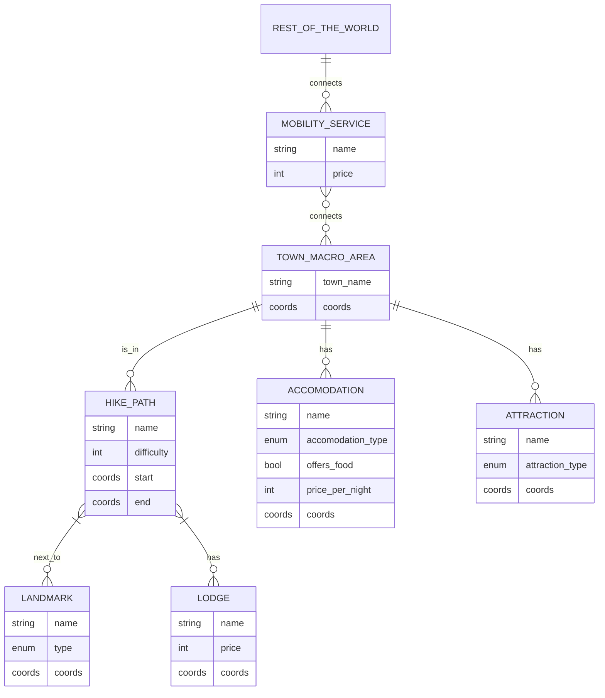

# Purpose Definition

### Informal Purpose

A service that allows people or vacation agencies to plan for their hikes in Trentino's territory, based on:
- their __expertise__ in hiking
    - are there children?
    - are there only able bodied but not expert adults?
    - are there only experts?
    -
- how big of a group should consider this hike
- in which __period__ of the year is this accessible
- the kind of experience they want
    - looking for particular __landmarks__?
    - presence of "__services__" (bivouacs/refuges/lodges/moutain huts)
- the __access__ to the route:
    - is a car required to get there?
- the __accomodation__ for the rest of the vacation:
    - are there nearby hotels/camping sites?
- other __attractions__ in the same area (related or not to the hike):
    - ski slopes
    - museums

## Formal Purpose

### Context

- location: Trentino region
- time: divided by season

### Personas and scenarios

- someone who wants to plan a week long vacation with their family
- a travel agency employee preparing a vacation package to offer
- a local looking for a hike to do on his own during the weekend
- a hiker who is looking for a more nature-immersive experience
- a primary school teacher planning for a school trip
- ...
- TODO

### Competency Questions

- What are simple hikes with great wintery natural views suitable for a family vacation?
    - "family vacation" -> can we assume long so requires accomodation?
    - no specification of vehicles means they have access to car?
- Give hikes next to places with ski slopes
- What hikes can I go to if I am spending a week in Folgaria?
- Where can I go on a hike in a summer break weekend with my college/work friends?
- Long hikes with overnight stay in refuge with running water
- ...
- TODO

### Concepts and Terms

- hike paths (difficulty, active_seasons, max-min group size)
- landmarks (type, active_season, bool_requires_detour_from_path)
- lodges (*services_provided, stars_score, price)
- accomodation (type, stars_score, price)
- mobility services
- town_macro_area
- attraction

### ER model *** (!!! Prof said it is not exactly an ER model even thought it's called that in the slides) -> cardinality of relationships should not matter

